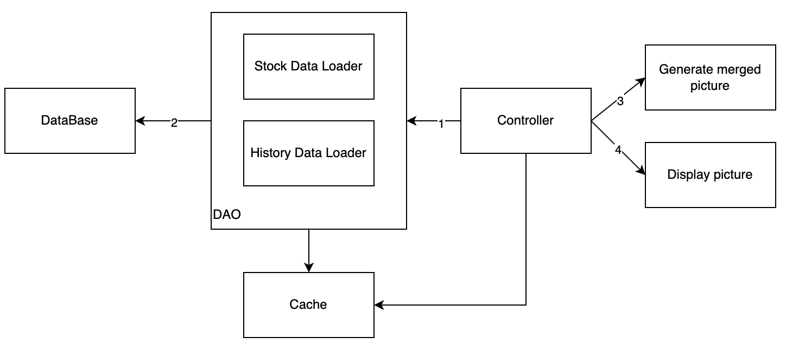

# Stock History Display

Available on Heroku: https://stock-history-display.herokuapp.com/

## Introduction
The purpose of this project is something an easy yearly review tool for your stock performance. This app will help you get a very quick and clear view of your past invesment, about whether you earn or loss, about how much you earn and loss, about when you buy-in and sell-out, about the volume in related buy/sell threade. We both know it's pretty annoying to review your Robinhood history long list and it's not clear at all.

By the help of this app, users will be able to have a better view from their past investment, and also get some feedback from it. This is super important in improving future stock market performance. 

## Sample result


## System Structure


## Steps
- Step 1: Input stock abbreviation: By default, it is TSLA, which is the abbreviation of TESLA
- Step 2: Copy and paste buy/sell histories from [Robinhood history page](https://robinhood.com/history/e39ed23a-7bd1-4587-b060-71988d9ef483), make sure you follow the format, more detail on [How to Copy History](#How-to-Copy-History)
- Step 3: (Optional) Choose a period: 1 year or 5 year. Also, you can choose a filter which could filter out small profit line to reduce distraction, default = 10.
- Step 4: Click submit, then you should see buy/sell history picture attached to your stock line chart as below

## Current Feature
- Tech Stacks: `Python, Flask, Html, JSON, Docker, Heroku`
- fetch Stock data from Yahoo Finance API
- persist Stock data as file to reduce duplicated Yahoo Finance API request 
- parse history data: the personal operations history, like when you make a buy-in or sell-out transaction, this will add a datapoint into history. This app support parse data from history following Robinhood history page format. You may paste history from Robinhood history page.
- [Thread transaction](#Thread-Transaction) generated from history data
- bypass browser cache by random number naming
- support parsing complicated transactions and generating simple buy or sell threads. 
- clear green and red view for earn and loss. 4K (3840x2160) definition picture for 1 year data. Extended X-size when period is long. 
- support split in history
- Display statistics regarding thread transaction. 

## Thread Transaction
This is also called profit_segment in the code, which is a segment of information regarding a thread of investment. I will explain this with a example
Let's say somebody make below transactions:

```
Buy 2 stocks at day 0, with unit price 1
Sell 1 stocks at day 1, with unit price 2
Buy 1 stocks at day 2, with unit price 3
Sell 2 stocks at day 3, with unit price 2
```
Then, this will generate below thread transactions:
```
[start_time, end_time, volume, profit]
[day 0, day 1, 1, 1]
[day 0, day 3, 1, 1]
[day 2, day 3, 1, -1]
```

## Future
- Redis Cache
  - for merged picture, key is `stock name + period + interval + SHA256(history data)`
  - for stock data, key is `stock name + period + interval`
  - for history data, key is `SHA256(history data)`
- MySQL storage
  - 3 tables: stock data table, history data table and users table
- support personal accounts, and support google login in
- better de-deplicate mechanism, potentially using hash, SHA256
- scale by different time length, year, month, day, etc
- a broader system design
- beautify UI by Bootstrap

## How to Copy History


## Reference
- https://github.com/ranaroussi/yfinance
- https://robinhood.com
- https://heroku.com/
- and many others
